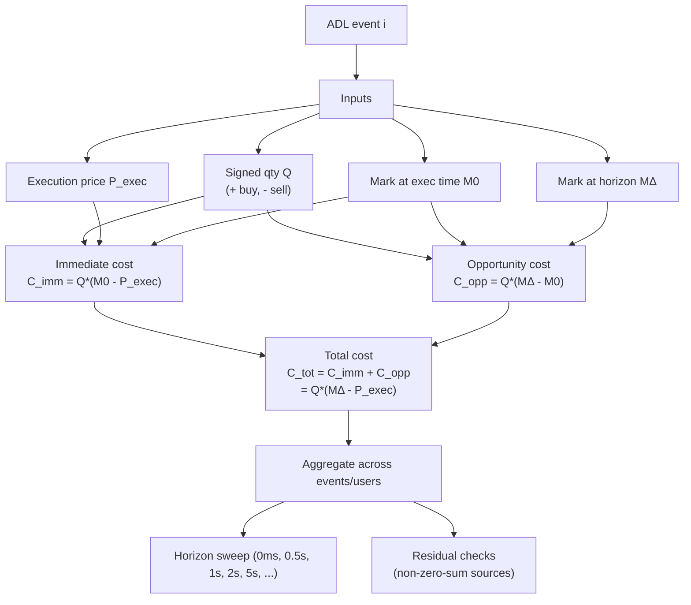

# Dan Robinson Q&A

## Q1) Is your methodology basically a short-horizon markout on the ADL execution (e.g. 5 seconds)?

**Answer:** It's a markout-style measurement, but not only 5 seconds.

What we compute is: If you force-close an ADLed position at an execution price now, what is the implied cost if you value that same position at the mark price after a chosen horizon? (This is a counterfactual valuation: what the position would have been worth at marks $\Delta$ seconds later if it had not been forcibly flattened.)

- We evaluate a horizon sweep ($\Delta = 0\text{ ms}, 0.5\text{ s}, 1\text{ s}, 2\text{ s}, 5\text{ s}, \ldots$).
- $\Delta = 0$ isolates the immediate execution-vs-mark component.
- $\Delta > 0$ adds the opportunity cost of being forcibly flattened along the realized price path over the next $\Delta$ seconds.

So "5-second markout" is one scenario in the sweep, not the whole methodology.

---

## Q2) You wrote $(\text{mark} - \text{execution}) \times \text{quantity}$ is not perfectly zero-sum in the dataset. Why not?

**Answer:** Dan's intuition is right for two-party cashflows under ideal pairing. To be precise: the *execution cashflow* between bankrupt side and ADLed side is close to zero-sum (up to fees/insurance/bankruptcy rules), but the *markout cost* $Q \cdot (M_{\Delta} - P_{\text{exec}})$ is not a two-party cashflow identity and need not sum to zero across parties. Our metric is a markout-based cost computed from marks at specific timestamps and (often) does not correspond to a single perfectly paired two-party transfer in raw data.

There are three concrete reasons small non-zero residuals show up:

1) **This is a markout metric, not a pure cashflow ledger.**  
   We're computing a cost for the ADLed side as $Q \cdot (M_{\Delta} - P_{\text{exec}})$. That's a valuation-based measure, not a direct statement about where every dollar went.

2) **ADL fills and liquidation deficit are not always 1:1 matched in observable data.**  
   ADL can clear against multiple sources of deficit; fills can be split; events can be netted across many accounts. Even if the protocol-level accounting is clean, the dataset you reconstruct from can fail to provide a perfect "this ADL fill ↔ that liquidation fill" pairing.

3) **There can be a real "system wedge" (bankruptcy rules / insurance / fees / buffers).**  
   Many systems don't settle the bankrupt side exactly at the ADL execution price in a way that makes the transfer purely two-party. If the liquidated account is made slightly better off than pure bankruptcy (dust remainder, fees, insurance top-up, rounding), the residual is effectively paid by insurance/buffers/fees rather than being attributable to a single matched counterparty trade.

Important clarification: "Not perfectly zero-sum in the dataset" does not mean ADL creates or destroys value. It means the specific markout statistic is not a perfect two-party ledger identity under imperfect pairing + time-indexed marks + possible system wedges. If you instead define and compute a symmetric markout metric for the bankrupt side using the same mark timestamps and a fully paired trade map, the residual shrinks; without perfect pairing it will not vanish.

---

## Q3) Does this accounting identity check out? Opportunity + immediate = total, and are signs consistent?

**Answer:** Yes, once you lock a sign convention.

We define everything from the ADLed user's perspective:

- Signed quantity $Q$:
  - $Q > 0$ means the ADLed user is forced to buy (cover shorts).
  - $Q < 0$ means the ADLed user is forced to sell (close longs).
- Execution price: $P_{\text{exec}}$
- Mark at execution (nearest mark snapshot): $M_0$
- Mark at horizon $\Delta$ later: $M_{\Delta}$
- Convention: cost is negative when the ADLed user is worse off.

Then:

Immediate execution cost (vs mark at execution):

$$
C_{\text{imm}} = Q \cdot (M_0 - P_{\text{exec}})
$$

Opportunity cost (mark moves after you were forcibly flattened):

$$
C_{\text{opp}} = Q \cdot (M_{\Delta} - M_0)
$$

Total cost (markout vs execution):

$$
C_{\text{tot}} = Q \cdot (M_{\Delta} - P_{\text{exec}})
$$

And indeed:

$$
C_{\text{tot}} = C_{\text{imm}} + C_{\text{opp}}
$$

---

## Worked examples

**Example 1: Dan's sign check**  
ADLed user sells 10 units at \$5. Mark $\Delta$ later is \$6.

- $Q = -10$, $P_{\text{exec}} = 5$, $M_0 = 5$, $M_{\Delta} = 6$  
- Total cost $= (-10) \cdot (6 - 5) = -10$

Interpretation: forced to sell at 5, price is 6 shortly after, so **\$10 loss (negative).**

**Example 2: Decomposition matters (mark-at-exec differs from execution)**  
ADLed user sells 10 units at \$5.00. Mark at execution is \$5.20. Mark $5\text{ s}$ later is \$6.00.

- $Q = -10$  
- $P_{\text{exec}} = 5.00$  
- $M_0 = 5.20$  
- $M_{\Delta} = 6.00$

Immediate $= (-10) \cdot (5.20 - 5.00) = -2.00$  
Opportunity $= (-10) \cdot (6.00 - 5.20) = -8.00$  
Total $= (-10) \cdot (6.00 - 5.00) = -10.00$

Interpretation: \$2 is "instant fill vs mark," \$8 is "price moved after forced close," total is \$10.

**Example 3: Why "not perfectly zero-sum" can appear without violating economics**  
Suppose bankruptcy/insurance rules make the bankrupt account end slightly better than pure bankruptcy (dust remainder, buffer, or insurance subsidy). That "betterment" is funded by the system (insurance/fees/buffers), not a single perfectly matched counterparty fill.

If you compute the ADLed side's markout cost using time-indexed marks and do not have a clean 1:1 pairing between liquidation deficit and ADL fills in the dataset, you can observe a small residual in aggregate. That residual is best interpreted as (a) pairing/timestamp mismatch + (b) system wedge, not as "value creation."

**Example 4: Buy-side sign check (symmetric)**  
ADLed user buys 10 units at \$6. Mark $\Delta$ later is \$5.

- $Q = +10$, $P_{\text{exec}} = 6$, $M_0 = 6$, $M_{\Delta} = 5$  
- Total cost $= (10) \cdot (5 - 6) = -10$

Interpretation: forced to buy at 6, price is 5 shortly after, so **\$10 loss (negative).**

---

## Mermaid diagram (methodology flow)

Note: the flow emphasizes why perfect invariants are hard to validate from public data alone (no OSS execution logs), so small residuals can appear even when accounting is internally consistent.