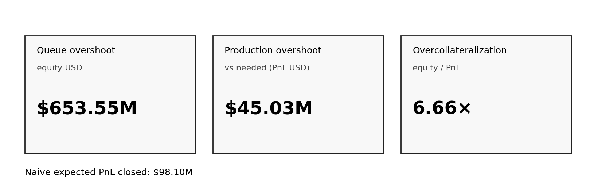
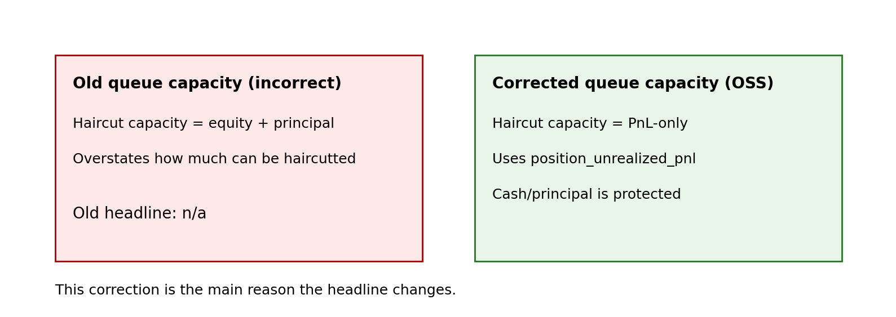
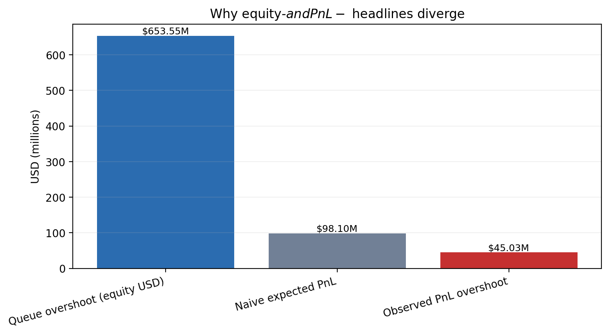
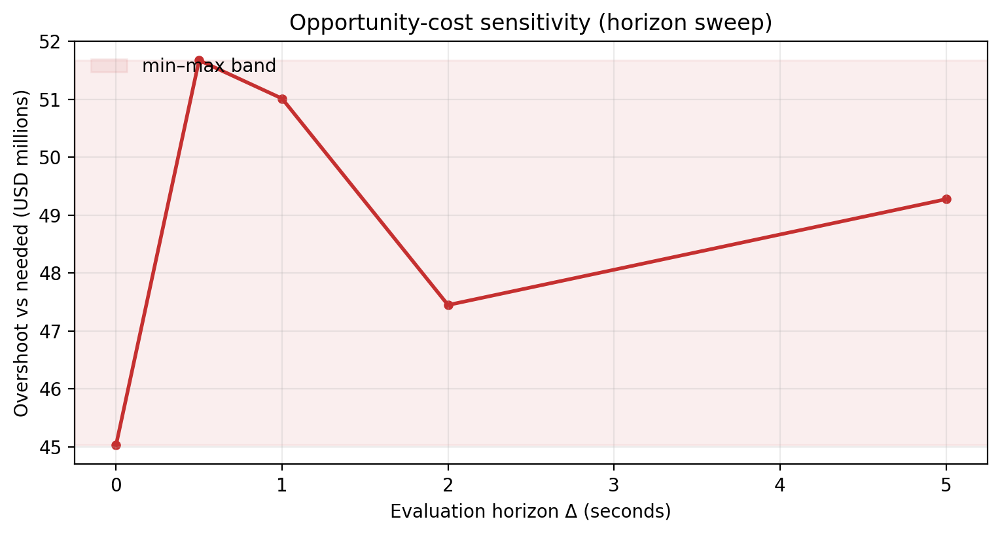
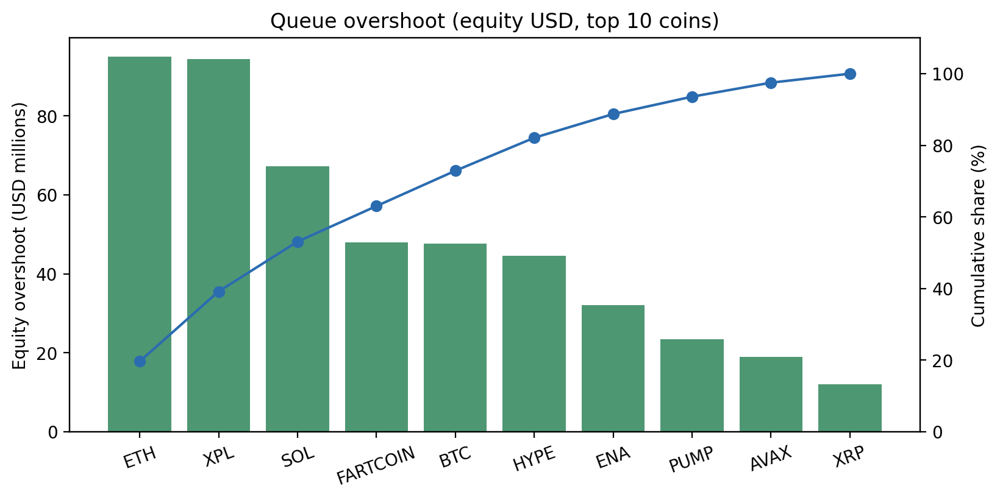
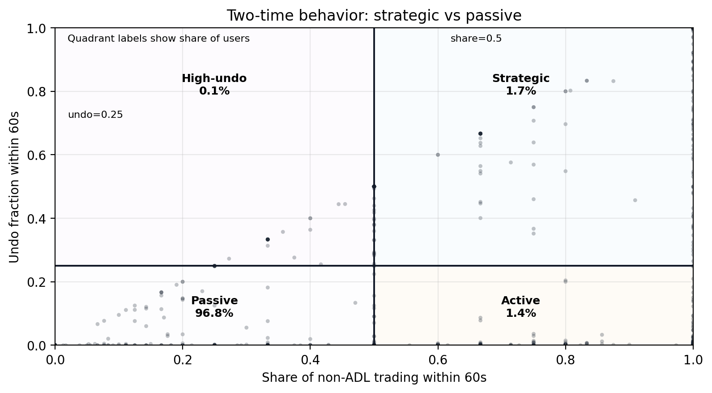
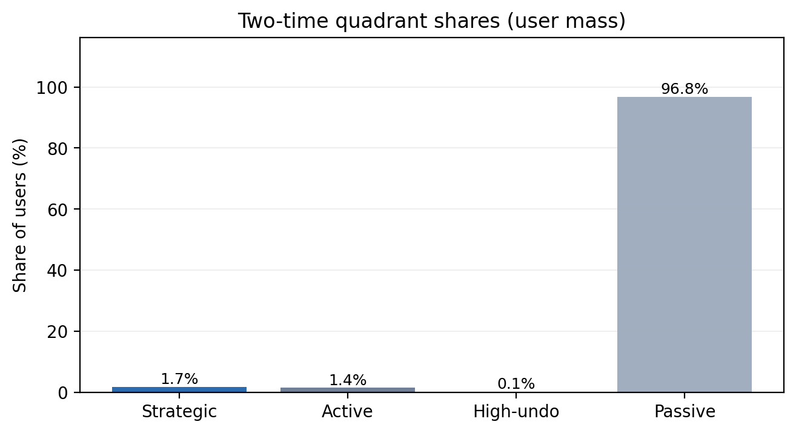
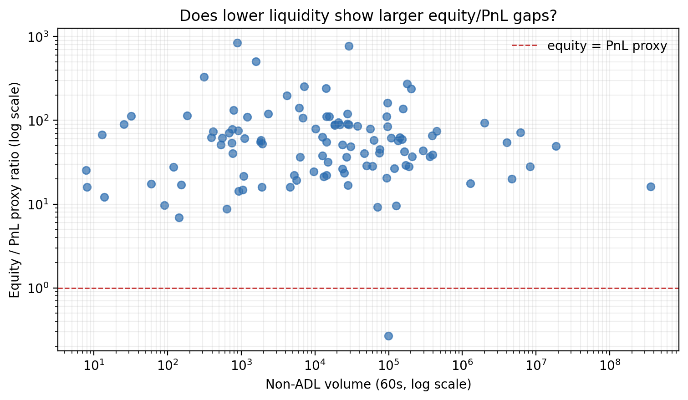
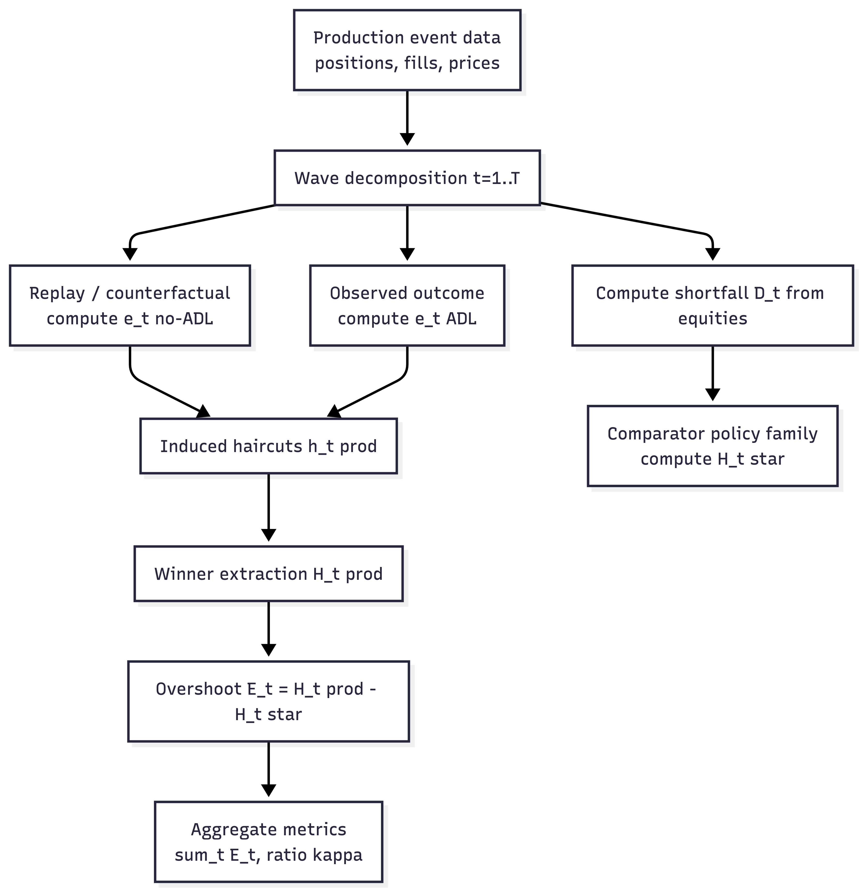
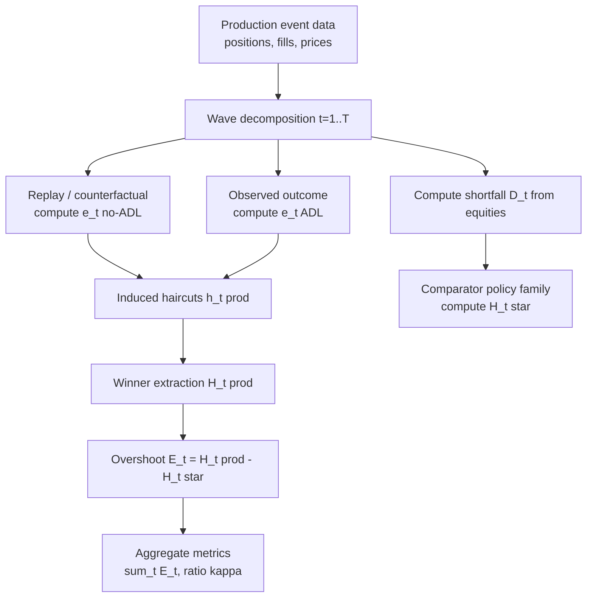

# ADL Corrections Full Report

## Executive summary

This note is a companion to two blog posts in this series ([post 1](https://thogiti.github.io/2025/12/11/Autodeleveraging-Hyperliquid-653M-debate.html), [post 2](https://thogiti.github.io/2025/12/14/ADL-Trilemma-Dan-Critique-Tarun-paper-fixes.html)) and the related threads ([x.com 1](https://x.com/tarunchitra/status/1998985133303701673), [x.com 2](https://x.com/tarunchitra/status/2001231023364038796), [x.com 3](https://x.com/tarunchitra/status/1998451762232177041)). It consolidates the technical corrections and the empirical methodology into one place so a reader can audit the assumptions, the unit conventions (contracts vs equity), and the meaning of the headline numbers (overshoot, "\$653m", "28x", etc.).

The core message is narrow:

1. Production ADL on venues like Hyperliquid is executed in contract space.
2. The theoretical analysis in Tarun's paper is written in wealth space (equity haircuts).
3. To compare production ADL to model ADL you need an explicit mapping.
4. Once the mapping is explicit, you can ask an apples-to-apples question: how much winner equity was removed by production ADL versus a comparator policy that covers the same deficit?

**Key headlines:**

- Queue overshoot (equity USD): \$653,552,663.51
- Production overshoot vs needed (PnL USD, horizon=0): \$45,028,665.72
- Winner overcollateralization (trimmed mean): 6.66x
- Naive expected PnL closed (queue / ratio): \$98,103,722.75
- Naive expected over observed factor: 2.18x

Source: `out/headlines.json` and `out/summary_totals.csv`.

Note: headline uses horizon=0 (\$45,028,665.72).
Horizon sweep examples: 500ms: \$51,673,606.61, 1000ms: \$51,012,123.23.

**Sanity bound (naive inefficiency; no markouts / no impact).**
Readers often have a simple sanity-check model in mind: in each ADL wave, the deficit proxy $B_{\text{needed}}$ is matched 1-to-1 against winner PnL at the clearing price, with no markout horizon and no market impact model. In our framework, that is exactly the horizon = 0 construction.

Under that naive model, the lower bound on inefficiency is \$0, and the upper bound is the horizon = 0 overshoot vs the deficit proxy: \$45,028,665.72.

Figure 03 shows how overshoot changes when you choose a non-zero evaluation horizon (a scenario choice, not statistical robustness).

## Glossary / Thesaurus (paper vs debate vs code)

This note involves three overlapping vocabularies. The same words ("haircut", "capacity", "overshoot", "queue") can mean different objects depending on whether we are talking about: (i) the abstract model in the paper, (ii) production ADL implementations, or (iii) the reconstruction/measurement model in this repo.

### A) Spaces and their primitives

**Wealth space (paper / theory).**

- State variable: equity per account/position, $e_{i,t}$.
- Equity decomposition: $e_{i,t} = c_{i,t} + \mathrm{PnL}_{i,t}$.
- ADL action: directly reduces winner wealth via a haircut fraction $h_i$ applied to a chosen base (paper: often $(e_{i,t})_+$; corrected model: $(\mathrm{PnL}_{i,t})_+$).

**Contract space (production / engine).**

- State variable: contracts/position size $q_{i,t}$ and collateral/margin rules.
- ADL action: forces position reductions $\Delta q_{i,t}$ based on a ranking (often a queue) and executes trades at some execution price under matching/settlement rules.

**Observation space (public-data reconstruction / this repo).**

- Observables: fills, marks, and account aggregates from public endpoints.
- Missing: full internal clearing/settlement logic, netting, fee/buffer application, exact timing/priority details.
- "Haircut" is inferred from equity differences under a replay, not directly observed as a ledger transfer.

### B) Core objects and "same word, different meaning"

#### 1) Deficit / shortfall / bad debt

**Paper (wealth space):**

- Deficit (bad debt) is loser-side negative equity:

$$
D_t = \sum_i (-e_{i,t})_+.
$$

**Production (contract space):**

- Deficit is whatever the clearing engine cannot collect after liquidation(s), including settlement rules, buffers, and insurance behavior.

**Repo (observation model):**

- Deficit waves are reconstructed from loser-side equity aggregates (public data).

#### 2) Haircut capacity / winner resources

**Paper (original phrasing):**

- Often described as winner equity mass, $W_t = \sum_i (e_{i,t})_+$.

**Corrected / mapping model (repo + fixes):**

- Haircut capacity is positive PnL only:

$$
U_t = \sum_i (\mathrm{PnL}_{i,t})_+.
$$

- Interpretation: in the mapping model, ADL seizes profits, not principal/collateral.

**Why this matters:**

- Under PnL-only capacity, $W_t > D_t$ does not imply the deficit is coverable in one round.
- The correct feasibility check is $U_t \ge \theta D_t$ (or $U_t \ge D_t$ for full coverage).

#### 3) Queue

**Paper (wealth-space queue):**

- A selection rule over winners in wealth space (who gets haircutted and by how much), operating on an endowment vector (originally $(e_{i,t})_+$, corrected to $(\mathrm{PnL}_{i,t})_+$).

**Production (contract-space queue):**

- A ranking of positions/accounts by some score (PnL, leverage, etc.), determining which contracts are reduced first. The resulting equity impact depends on price/execution and on how much equity is tied to the closed contracts.

**Repo usage:**

- "Queue" always needs a qualifier: wealth-space queue (theory comparator) vs contract-space queue (observed implementation).

#### 4) Overshoot / unnecessary haircuts

**Paper (wealth space, as an abstract diagnostic):**

- Overshoot can mean excess extraction relative to a comparator policy for the same deficit.

**Repo (two distinct metrics):**

- Wealth-space overshoot (equity USD): a diagnostic comparing induced wealth removed under observed ADL to a comparator wealth-space policy under the same deficit definition.
- Production overshoot vs needed (PnL USD, horizon=0): a reconstruction objective that compares observed PnL seized vs a deficit proxy $B_{\text{needed}}$ under the horizon=0 (no-markout) construction.

**Important guardrail:**

- Any headline like USD 653m overshoot is a wealth-space diagnostic under a PnL-only capacity definition, not a direct statement that collateral/principal was "saved" in production.

#### 5) Markout / opportunity cost

**Not used as the overshoot metric in this report.**

- Markout-style costs compare execution to a mark price at horizon $\Delta$: $Q(M_{\Delta} - P_{\text{exec}})$.
- This is a diagnostic tool and is not expected to be perfectly zero-sum in public data due to pairing/timestamp mismatch and possible system wedges (fees/buffers/insurance/bankruptcy rules).

### C) Quick mapping table (where to look in code)

- Loser deficit waves ($D_t$): `src/oss_adl/bad_debt.py`
- PnL-only capacity ($U_t$): `src/oss_adl/queue_overshoot.py`
- Two-pass replay haircuts / induced wealth removed: `src/oss_adl/two_pass_replay.py`
- Policy comparisons (pro-rata / mirror descent / etc.): `policy_per_wave_metrics.csv`
- Markout diagnostic Q&A: `docs/FAQs.md`

## Background and problem statement

### What ADL is doing

When liquidations fail (latency, oracle jumps, thin liquidity, adversarial orderflow), the system can end up with a shortfall: some accounts have negative equity that cannot be collected. ADL is one way to restore solvency by transferring wealth from solvent accounts to cover that deficit.

We will use the following wealth-space aggregates over a position set $P_n$ at a wave/end time:

Total shortfall (bad debt):

$$
D_T(P_n) = \sum_{p \in P_n} \bigl(-e_T(p)\bigr)_+.
$$

Total winner equity:

$$
W_T(P_n) = \sum_{p \in P_n} e_T(p)^+.
$$

### The contracts-vs-wealth mismatch

A lot of the public disagreement came from mixing two different spaces:

- Contract space (production): the engine selects positions by a ranking score and forces contract-level reductions.
- Wealth space (theory): a policy selects haircut fractions $h(p) \in [0,1]$ and directly reduces winner equities.

A close in contracts is not the same statement as haircut 100% of equity. The economic effect depends on prices and on how much of the account's equity is attributable to the seized contracts.

### What this report is correcting

This note is focused on three corrections and clarifications that make the model-to-production comparison well-defined:

1. Queue interpretation: treat the queue in the theory as a wealth-space abstraction.
2. Pro-rata definition: separate wealth-pro-rata from contracts-pro-rata.
3. The headline number: define excess haircuts as an equity-dollar difference against a benchmark.

## Corrections implemented

- Queue overshoot capacity now uses PnL-only (`position_unrealized_pnl`), not equity + principal.
  - Code: `src/oss_adl/queue_overshoot.py:73`
- Queue overshoot deficit proxy is loser-side, not winner equity (selection + magnitude) and keeps per-coin clustering.
  - Code: `src/oss_adl/queue_overshoot.py:178`, `src/oss_adl/queue_overshoot.py:289`
- Production overshoot is reconstructed with two-pass replay (ADL-on vs ADL-off on the same price path).
  - Code: `src/oss_adl/two_pass_replay.py:308`, `src/oss_adl/two_pass_replay.py:556`
- Loser deficit waves use loser-side equity and global time clustering.
  - Code: `src/oss_adl/bad_debt.py:39`, `src/oss_adl/bad_debt.py:59`

## Methodology map from paper to analysis code

- Queue overshoot (wealth-space queue): `methodology.md` section 3.7; `src/oss_adl/queue_overshoot.py`.
- Loser deficit waves $D_t$: `methodology.md` section 3.2; `src/oss_adl/bad_debt.py`.
- Needed budget $B_{\text{needed}}$: `methodology.md` section 3.3; `src/oss_adl/two_pass_replay.py`.
- Production haircut $H_{\text{prod}}$: `methodology.md` section 3.4; `src/oss_adl/two_pass_replay.py`.
- Horizon sweep $\Delta$: `methodology.md` section 3.6; `src/oss_adl/two_pass_replay.py`.
- Winner overcollateralization: `methodology.md` section 3.8; `src/oss_adl/queue_overshoot.py`.
- Two-time behavior (undo fraction): `methodology.md` section 3.9; `src/oss_adl/two_time_behavior.py`.

## Visualizations and what each is showing

### 00. Overview Tiles


Figure 00. Overview Tiles

Quick read of the three headline quantities and the naive expected PnL closed.

### 01. Definition Diff (the core fix)


Figure 01. Definition Diff (the core fix)

Queue capacity must be PnL-only, not equity + principal.

### 02. Mapping Bars (why the gap exists)


Figure 02. Mapping Bars (why the gap exists)

Naive equity-to-PnL mapping still overpredicts observed PnL overshoot.

### 03. Horizon Robustness


Figure 03. Horizon Robustness

Overshoot vs evaluation horizon. This is a counterfactual choice, not statistical robustness; the slope reflects time sensitivity.

### 04. Queue Concentration


Figure 04. Queue Concentration

Shows whether queue overshoot is broad-based or dominated by a few coins.

### 05. Two-Time Scatter (strategic vs passive)


Figure 05. Two-Time Scatter (strategic vs passive)

Behavioral classification using undo fraction vs trading share.

### 06. Two-Time Quadrant Shares


Figure 06. Two-Time Quadrant Shares

User-weighted quadrant shares.

### 07. Two-Time Quadrant Shares (Volume-weighted)


Figure 07. Two-Time Quadrant Shares (Volume-weighted)

Volume-weighted quadrant shares (strategic share can dominate by volume).

### 08. Response-Time Proxy (strategic vs passive)

Latency is computed from per-event time to first non-ADL fill (60s window).

| cohort | n_users | n_events | median | p10 | p90 |
| --- | --- | --- | --- | --- | --- |
| strategic | 322 | 759 | 31.6 s | 3.5 s | 1.2 min |
| passive | 18,726 | 3,194 | 9.0 min | 1.3 min | 34.0 min |

Per-symbol comparisons below use a PnL-closed proxy: the per-coin needed budget from ADL fill gaps ($|\mathrm{markPx}-\mathrm{execPx}|\times|\mathrm{size}|$) at horizon=0.

### 09. Equity vs PnL Proxy (per symbol)


Figure 09. Equity vs PnL Proxy (per symbol)

Each point is a symbol; color encodes non-ADL volume (liquidity proxy).

### 10. Gap Ratio vs Liquidity


Figure 10. Gap Ratio vs Liquidity

Weak/no trend indicates volume alone does not explain the gap.

### 11. Largest Equity/PnL Gaps


Figure 11. Largest Equity/PnL Gaps

Largest equity/PnL proxy gaps (filtered to avoid tiny denominators).

### 12. Undo Fraction vs Impact Proxy (per coin)


Figure 12. Undo Fraction vs Impact Proxy (per coin)

Per-coin undo fraction vs impact proxy (gap per contract). Noisy in aggregate; diagnostic per coin.

These per-asset gaps are relevant for considering asset-specific ADL mechanisms based on liquidity.

## Definitions used in this report

### Positions and equity

A position is modeled as

$$
p = (q, c, t, b),
$$

where $q$ is signed base contracts, $c$ is collateral, $t$ is entry time, and $b$ is side.
Equity at time $T$ is

$$
e_T(p) = c + \mathrm{PnL}_T(p).
$$

### Wealth-space ADL policies

A wealth-space ADL policy $\pi$ is represented by:

- a severity parameter $\theta^\pi \in [0,1]$ choosing a budget $B = \theta^\pi D_T(P_n)$, and
- a haircut fraction $h^\pi(p) \in [0,1]$ for each winner with $e_T(p) > 0$.

Post-ADL equity is

$$
e_T^{\mathrm{post}}(p) = (1 - h^\pi(p)) e_T(p) \quad \text{for } e_T(p) > 0.
$$

## Methodology

### 1. Wave decomposition

The event is treated as a sequence of ADL waves indexed by $t = 1,2,\dots,T$.

For each wave $t$, we identify the pre-wave position set $P_n^{(t)}$, and compute the shortfall:

$$
D_t = \sum_{p \in P_n^{(t)}} \bigl(-e_t(p)\bigr)_+.
$$

### 2. Induced wealth-space haircuts from production ADL

To compare production ADL to wealth-space policies, we define two equity outcomes for each position on the same realized price path:

- $e_t^{\mathrm{no\text{-}ADL}}(p)$: counterfactual where ADL is disabled in wave $t$ while holding the realized price path fixed.
- $e_t^{\mathrm{ADL}}(p)$: realized equity after production ADL in wave $t$.

Define the induced haircut:

$$
h_t^{\mathrm{prod}}(p) =
\begin{cases}
\dfrac{e_t^{\mathrm{no\text{-}ADL}}(p) - e_t^{\mathrm{ADL}}(p)}{e_t(p)}, & e_t(p) > 0, \\[6pt]
0, & \text{otherwise}.
\end{cases}
$$

Total wealth removed from winners in wave $t$ is

$$
H_t^{\mathrm{prod}} = \sum_{p \in P_n^{(t)}} \bigl(e_t^{\mathrm{no\text{-}ADL}}(p) - e_t^{\mathrm{ADL}}(p)\bigr)_+.
$$

### 3. Comparator policies and overshoot

Let $H_t^{\star}$ be the winner-equity extraction under a comparator policy family that covers the same deficit.

Define overshoot (excess haircut) in wave $t$:

$$
E_t = H_t^{\mathrm{prod}} - H_t^{\star}.
$$

Aggregate overshoot:

$$
E_{\mathrm{total}} = \sum_{t=1}^T E_t.
$$

### 4. Interpretation of the \$653m figure

When the analysis reports an excess haircuts number like \$653m, the intended meaning is:

*It is the sum of equity-dollar differences between production ADL and a benchmark policy that covers the same deficits.*

Formally:

$$
\$653\text{m} \equiv \sum_{t=1}^T \bigl(H_t^{\mathrm{prod}} - H_t^{\star}\bigr).
$$

This is not the notional value of positions closed.

## Results summary

### Mechanism-design takeaway (separate from price-path choices)

There are two different knobs in this report, and they should not be conflated:

1. Policy-dependent (mechanism design): who you select to bear the haircut in each wave (queue vs pro-rata vs leverage-weighted variants), holding the same realized event data and the same deficit proxy definition fixed.
2. Path-dependent (scenario choice): how you define the evaluation window for markouts / opportunity cost (the horizon sweep in Figure 03).

The cleanest, least controversial takeaway is the policy ordering in (1): under this reconstruction objective (overshoot/residual in equity space), queue-style selection concentrates haircuts, while leverage-weighted or waterfilling-style rules spread the burden. This is a ranking under the overshoot/residual metrics, not a full welfare ranking under execution constraints.

You can read that ordering directly from `policy_per_wave_metrics.csv` by comparing total overshoot vs needed across policy families with the evaluation horizon fixed.

Policy ordering (total overshoot vs needed, horizon fixed):

| policy | definition | total_overshoot_usd |
| --- | --- | --- |
| production (queue) | Observed production ADL (queue-based selection). | \$45,028,665.72 |
| vector (mirror descent) | Vector mirror-descent allocation toward budget. | -\$1,793,022.03 |
| fixed-point ILP (integer) | Integer program for fixed-point targets. | \$92,186.99 |
| pro-rata | Wealth-proportional allocation (equity pro-rata). | \$0.00 |

Negative values indicate undershoot (haircuts below the deficit proxy).

Once you compute $H_t^{\mathrm{prod}}$ using induced equity losses, the empirical questions become well-posed:

1. Does production ADL concentrate haircuts on a small set of winners relative to a pro-rata benchmark?
2. Does production ADL overshoot the deficit coverage implied by the comparator family, and by how much?
3. How sensitive are these conclusions to the counterfactual definition of $e_t^{\mathrm{no\text{-}ADL}}$?

## Gaps and what is still missing

1. Counterfactual dependence: $e_t^{\mathrm{no\text{-}ADL}}$ is not directly observable.
2. Matching-engine opacity: without internal logs we cannot separate selection from execution with perfect fidelity.
3. Unit consistency: any substitution of notional contracts for equity dollars inflates headline numbers.
4. Markout metric: this cost measure is not a two-party cashflow identity, so it will not be exactly zero-sum in raw data under imperfect fill pairing, time-indexed marks, and potential bankruptcy/insurance wedges.

## Recommended edits to the paper

### 1. Make the regime condition explicit (interpretation, not a redefinition)

Keep Assumption J.3 as written, but add a short interpretation note (see point `9`) below that ties $\mu_\Phi$ to a sustainable diversion rate (e.g., via an LTV sensitivity constraint), without redefining the assumption.

Then state plainly: the trilemma is conditional; it is silent when $\mu_- \le \mu_\Phi$.

### 2. Cleanly separate policy families

- The queue analyzed in the theory is a wealth-space queue.
- Hyperliquid's implementation is a contract-space queue that induces a haircut vector via equity differences.
- Wealth-pro-rata and contracts-pro-rata are different mechanisms with different fairness meanings.

Without this separation, readers will conflate wealth-space theory results with contract-space implementation and misread empirical 'overshoot' as a production ledger claim.

### 3. Add a short empirical regime check

If the empirical section invokes the structural deficit regime, add a short paragraph that estimates whether the event satisfies $\mu_- \gg \mu_\Phi$ for the relevant window.

This check is an order-of-magnitude sanity test, not a precise identification of $\mu_-$ or $\mu_\Phi$.

### 4. Qualify the "\$653M" headline as wealth-space overshoot

Add one sentence immediately after the first "\$653M" claim in the abstract/intro, and the same qualifier after the "\$653.6M overshoot" sentence in §9.2:

> This figure is a wealth-space overshoot diagnostic computed under the paper's $\mathrm{PnL}$-only haircut capacity definition. It is not a direct claim that this amount of collateral/principal could have been saved in production, because execution/settlement mechanics are not fully observable from public data under the stated observation model.

### 5. Add a scope note in §2.5 (theory vs measurement)

Insert a short paragraph right after the trilemma statement (Proposition 2.1):

> Scope note. The ADL trilemma is a statement about an abstract policy model (static ADL families under Assumptions J.1–J.3). It does not rely on any empirical "two-party zero-sum fill" identity or on observing a complete execution/settlement ledger. Empirical sections map public observations onto model objects; that mapping is separate from the theorem.

### 6. Add a metric-agnostic observation-model note in §9.1

At the start of §9.1, add:

> Observation model (public data). Our reconstruction uses publicly available fills, marks, and account-level aggregates. It is not a full execution/clearing ledger: we do not observe the complete settlement logic, internal netting, fees/buffers, or all timing details. This is sufficient to compute the paper's empirical objectives (deficits and winner $\mathrm{PnL}$ capacity) under stated definitions; as a result, we treat strict accounting invariants as diagnostics rather than hard identities.

If §9.1 claims the dataset provides an “exact sequence enabling counterfactual analysis,” soften it to: we observe the realized sequence of fills/marks/account aggregates sufficient to define a replay under the public-data observation model.

Also soften phrases like “high-fidelity replay” to “reconstruction under partial observability” where appropriate.

### 7. Make PnL-only capacity explicit (and align deficit vs capacity)

- Replace "winner equity vector" / "maximum haircut mass" with "winner positive $\mathrm{PnL}$ capacity vector" / "maximum $\mathrm{PnL}$-only haircut capacity" in §9.
- Add one sentence immediately after the first capacity definition:
  > Here, "capacity" refers to positive $\mathrm{PnL}$ (profits) available to be socialized; principal/collateral is not part of haircut capacity in this measurement model.
- Add an alignment note in Appendix I (Account aggregates):
  > Alignment note. In this empirical model, deficit is computed from losers' negative equity, while capacity is computed from winners' positive $\mathrm{PnL}$; this is a model choice and matches the corrected wealth-space haircut capacity definition used throughout §9.

### 8. Add a diagnostic markout decomposition in Appendix I (not §9’s overshoot metric)

Add a short Appendix I subsection (between I.2 and I.3) titled “Diagnostic decomposition (not the §9 overshoot metric)”:

> This subsection is a diagnostic for interpreting execution timing and for answering common "markout" questions. It is not the overshoot metric used in §9.  
>  
> Sign convention: $Q>0$ buys, $Q<0$ sells; cost is negative when the ADLed user is worse off.  
>  
> From the ADLed user’s perspective, define signed quantity, execution price, the nearest mark at execution time, and the mark at a chosen horizon later. Then the total markout vs execution decomposes into an immediate execution-vs-mark term plus an opportunity term from mark movement after forced flattening.  
>  
> Worked sign check: sell 10 at USD 5 and mark $\Delta$ later USD 6, then $Q=-10$ and $C_{\text{tot}}=(-10)(6-5)=-10$ (a USD 10 loss under the sign convention).  
>  
> If desired, this diagnostic can be evaluated across a horizon sweep (e.g., 0ms, 0.5s, 1s, 2s, 5s...).  
>  
> Because this diagnostic combines executions with time-indexed marks and public-data replay lacks full clearing/settlement observability, its aggregate is not expected to satisfy a strict two-party zero-sum identity in raw data. Any residual should be interpreted as a combination of imperfect fill pairing, timestamp alignment effects, and potential system wedges (fees/buffers/insurance/bankruptcy rules).

### 9. Appendix J remarks after Theorem J.7 (observability + regime boundary)

Add two short remarks immediately after Theorem J.7:

> Remark (interpretation of $\mu_\Phi$). In applications, $\mu_\Phi$ can be interpreted as the largest fee diversion rate that remains compatible with non-declining long-run venue value (e.g., via an LTV sensitivity constraint). This is an interpretation of the regime boundary, not a change to the formal assumption used in the proof.  
>  
> Remark (theorem vs observability). Theorem J.7 is proved in the policy model and does not assume any particular empirical observability of execution/settlement cashflows. Empirical tests necessarily operate under an observation model and should be interpreted as measurements of the paper's defined objects, not as complete ledger identities.

### 10. Minimal theorem corrections for the theorems in the paper

#### §2: Background

- **Make the haircut numeraire explicit (cash vs PnL).** Keep equity as $e_{i,t}=c_{i,t}+\mathrm{PnL}_{i,t}$, but state clearly that the empirical/mapping model in this repo treats **ADL haircuts as seizing positive PnL capacity only** (principal/collateral is returned on forced close, and it is modeled as protected and policy-independent under the public-data observation model, so it is not "haircut capacity").
  > In the empirical mapping used here, $\mathrm{PnL}_{i,t}$ denotes unrealized PnL at the venue's mark price / the repo's `position_unrealized_pnl` variable at time $t$.
- **Deficit stays loser-side negative equity.** Keep $D_t=\sum_i(-e_{i,t})_+$, and explicitly connect it to the loser-side construction (liquidated/insolvent accounts; see the repo's "loser deficit waves").
- **Introduce PnL-only winner capacity objects (replace equity-based capacity).** Anywhere the paper uses "winner equity mass" as the haircutable resource, replace it with:

  $$
  U_t = \sum_i (\mathrm{PnL}_{i,t})_+ \text{ (total positive PnL capacity)}
  $$

  $$
  \upsilon_t = \max_i (\mathrm{PnL}_{i,t})_+ \text{ (top winner positive PnL).}
  $$

  This is the minimal change needed for "haircuts in PnL space" consistency.
- **Update the ADL policy definition (haircut applies to $(\mathrm{PnL})_+$, not $e_+$).** Replace the post-policy update
  $$
  e_i \leftarrow (1-h_i)e_i
  $$
  with the PnL-only update
  $$
  \mathrm{PnL}_i \leftarrow \mathrm{PnL}_i - h_i(\mathrm{PnL}_i)_+,
  \qquad
  e_i \leftarrow c_i + \mathrm{PnL}_i.
  $$
- **Update budget balance + feasibility constraints accordingly.** Replace $e_t(\cdot)_+$ with $(\mathrm{PnL}_t(\cdot))_+$ in the policy constraints:
  $$
  \sum_i h_i(\mathrm{PnL}_{i,t})_+ \;=\; \theta D_t,
  \qquad
  \theta D_t \le U_t.
  $$
  (Feasibility should not be stated in terms of $W_t=\sum e_+$ under PnL-only capacity.)
  > Under PnL-only capacity, equity solvency $W_t-D_t>0$ does **not** imply one-round coverability; there is an intermediate regime $D_t < W_t$ but $D_t > U_t$ ("solvent-but-not-coverable" without touching principal).
- **Queue / pro-rata formulas:** In the queue and pro-rata examples, replace every instance of "haircut times winner equity" with "haircut times winner $(\mathrm{PnL})_+$" (scores/rankings can still be computed from leverage and realized/closed PnL; the key is the haircut base).

#### §3: Risk + fairness preliminaries

- Any fairness/risk metric described as "winner equity" should be interpreted as "winner profit" in the PnL-only model, i.e. based on $(\mathrm{PnL})_+$. Deficits $D_t$ remain computed from loser negative equity.
- PTSR/PMR and Schur/majorization comparisons are unchanged after the substitution "positive equity vector $\to$ positive PnL vector," since the proofs rely on budget-balance and convex/ordering arguments, not on the specific decomposition $e=c+\mathrm{PnL}$.
- If one evaluates fairness on total equity $e=c+u$ with heterogeneous $c_i$, affine shifts can change some orderings; the clean statement is that fairness/majorization claims apply to the haircutable endowment $u=(\mathrm{PnL})_+$.

#### §4: Severity optimization

- Replace the "maximum haircut mass" cap $\sum_i (e_{i,t})_+$ with $\sum_i (\mathrm{PnL}_{i,t})_+$ wherever it appears as the feasibility constraint.
- Severity/separation identities that depend only on the scalar budget $\theta D_t$ (e.g. $R_t=(1-\theta)_+D_t$) are unchanged under the PnL-only haircut base.

#### §5: Negative results

- Interpret $\omega_t$ (top winner) and the EV scale $b_n$ as extreme values of **positive PnL**, not of positive equity. All EVT-style bounds whose inputs are "(i) budget balance, (ii) maxima/means scaling" go through verbatim under this substitution.

#### §6: Fairness

- Apply the fairness axioms/optimality to haircuts on $(\mathrm{PnL})_+$ (and caps interpreted as limits on PnL haircuts), not to total equity. Capped pro-rata remains the unique convex-optimal rule under per-account caps after this substitution.

#### §7: Risk-aware policies (RAP)

- Keep insolvency modeling in equity (since insolvency is an equity concept), but treat the control variable as a haircut on $(\mathrm{PnL})_+$ that moves equity by the same dollar amount while leaving cash untouched. Replace any use of $(e_{i,t})_+$ as available haircut budget/capacity with $(\mathrm{PnL}_{i,t})_+$.

#### Do any of the theorems actually change?

In substance, **most proofs and qualitative orderings do not change**: they are statements about (i) a nonnegative winner endowment vector, (ii) a scalar budget $H=\theta D$, and (iii) how different allocation rules distribute that budget (concentration/majorization).

What *does* change is mostly **the statement of the objects**:

- **Mechanical substitution (most theorems):** replace the "winner equity" endowment $(e_t)_+$ by the "winner profit" endowment $(\mathrm{PnL}_t)_+$ everywhere it appears as haircut capacity. The same arguments go through with the substituted vector.
- **Proof sketch (cash as an affine shift).** Write each winner's equity as
  $$
  e_i \;=\; c_i + u_i,\qquad u_i = (\mathrm{PnL}_i)_+,
  $$
  where $c_i\ge 0$ is the protected cash/principal component and $u_i$ is the haircutable profit endowment.
  A PnL-only ADL action is equivalently an allocation of seized amounts $x_i\in[0,u_i]$ satisfying $\sum_i x_i = H$ (where $H=\theta D$ is the chosen budget), yielding post-ADL equities
  $$
  e_i' \;=\; c_i + (u_i - x_i).
  $$
  Since the cash vector $c$ is policy-independent in this model, comparing two policies $A,B$ cancels it:
  $$
  e^{\prime A}-e^{\prime B} \;=\; (u-x^A)-(u-x^B).
  $$
  Thus any theorem whose proof uses only (i) a budget identity in the haircutable endowment ($\sum_i x_i=H$ or $\sum_i u_i h_i = H$), and (ii) ordering/convexity/majorization properties of the survivor vector $u-x$ (or $u\odot(1-h)$), is unchanged after substituting the endowment vector from $(e_t)_+$ to $(\mathrm{PnL}_t)_+$.
  If in addition $c_i\equiv C$ is common across winners, then adding $C\mathbf 1$ preserves majorization/orderings, so equity-level fairness orderings are identical as well.
- **Real semantic change (coverability vs solvency):** under PnL-only haircuts, $\mathsf{Solv}_T=W_T-D_T>0$ does **not** imply the deficit is coverable by ADL. The correct one-round feasibility condition is $D_T \le U_T=\sum (\mathrm{PnL}_T)_+$. There is an intermediate regime $D_T<W_T$ but $D_T>U_T$ where the exchange is solvent in gross equity but cannot clear the deficit without touching principal.
- **RAP section (if kept equity-leverage-based):** RAP derivations written with multiplicative equity updates $e\mapsto (1-h)e$ should either (a) reinterpret $e$ in that section as the haircutable profit endowment, or (b) be re-derived under the additive PnL-only update $e=c+\mathrm{PnL}-h(\mathrm{PnL})_+$. The high-level "tilt haircuts toward higher-risk winners" conclusion is unchanged, but the exact algebraic form depends on which choice is made.

#### §8: Stackelberg + PoA ratios

Most theoretical results outside §8 use linear/additive haircut updates, so the PnL-only correction does not change their statements.

Section 8 is the exception: it includes a Stackelberg equilibrium (non-additive) and a PoA ratio that divides by equilibrium values. The ratio can be written as:

$$
\frac{C+\mathrm{PnL}_{\text{worst}}}{C+\mathrm{PnL}_{\text{avg}}}
\quad \text{or} \quad
\frac{\mathrm{PnL}_{\text{worst}}}{\mathrm{PnL}_{\text{avg}}}.
$$

**Remark (PoA ratio stability).** Assume the cash baseline $C$ is invariant across the equilibria being compared and $\min(|\mathrm{PnL}_{\text{worst}}|,|\mathrm{PnL}_{\text{avg}}|)\ge \varepsilon>0$ (equivalently, $C/\mathrm{PnL}_{\text{worst}}$ and $C/\mathrm{PnL}_{\text{avg}}$ are bounded). Then

$$
\frac{C+\mathrm{PnL}_{\text{worst}}}{C+\mathrm{PnL}_{\text{avg}}}=\frac{\mathrm{PnL}_{\text{worst}}}{\mathrm{PnL}_{\text{avg}}}\cdot\frac{1+C/\mathrm{PnL}_{\text{worst}}}{1+C/\mathrm{PnL}_{\text{avg}}}.
$$

Under this condition, the multiplicative factor is $O(1)$, so PoA ordering/bounds are preserved up to constants bounded by functions of $\varepsilon$ and $C$. If either equilibrium PnL is near zero, the ratio becomes ill-conditioned; treat that as a degenerate regime.

### 11. Optional: rename §9 to preempt “ledger invariant” critiques

Rename §9 to: “Empirical Analysis under Partial Observability: The October 10 Event.”

### 12. Global guardrail for headline numbers (search-and-patch)

Action: in the ADL paper, search for `653`, `658`, `28x`, `28 x`, `28×` and apply the same wealth-space/PnL-only qualifier wherever these appear. Also search for `unnecessary` and `inefficiency`, those are often where the "production savings" implication sneaks back in without the numbers.

Supplementary: a short Q&A addressing markout accounting and observability is in `docs/FAQs.md`.

## Mermaid diagram: how the pieces fit

Diagram summary: maps the empirical inputs (fills/marks) to reconstructed deficits, induced haircuts, and the overshoot metric used in this report.



Figure M1. Static diagram for PDF export.



## Appendix: mapping close in contracts to haircut in equity

A contract-space close is a statement about $\Delta q_t(p)$. A wealth-space haircut is a statement about $h_t(p)$. The induced-haircut definition makes this precise: it treats a close as relevant only insofar as it changes equity under the realized path, i.e., changes $e_t^{\mathrm{ADL}}(p)$ relative to $e_t^{\mathrm{no\text{-}ADL}}(p)$.

## How to Regenerate

1) Run the pipeline:

```bash
./run-all.sh          # uses bundled out/* data
./run-all.sh --full   # regenerates from raw HyperReplay
```

2) Generate the corrected visuals + this report:

```bash
./scripts/visualize_corrections.sh
```
